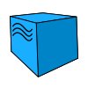
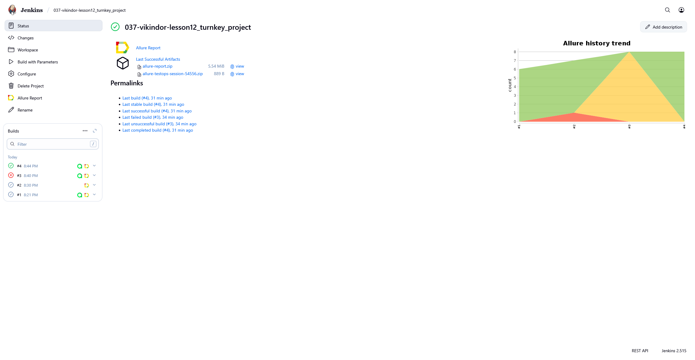
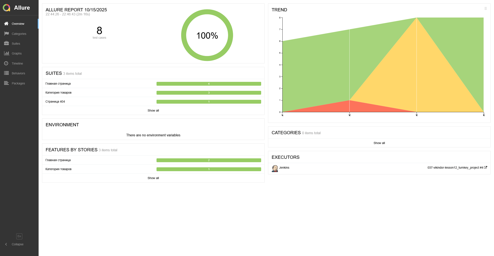
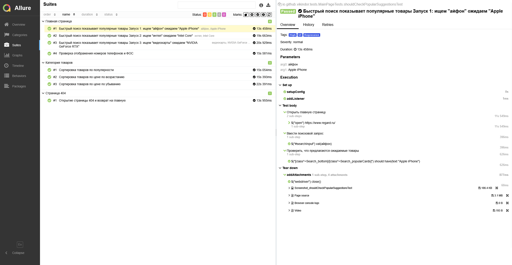
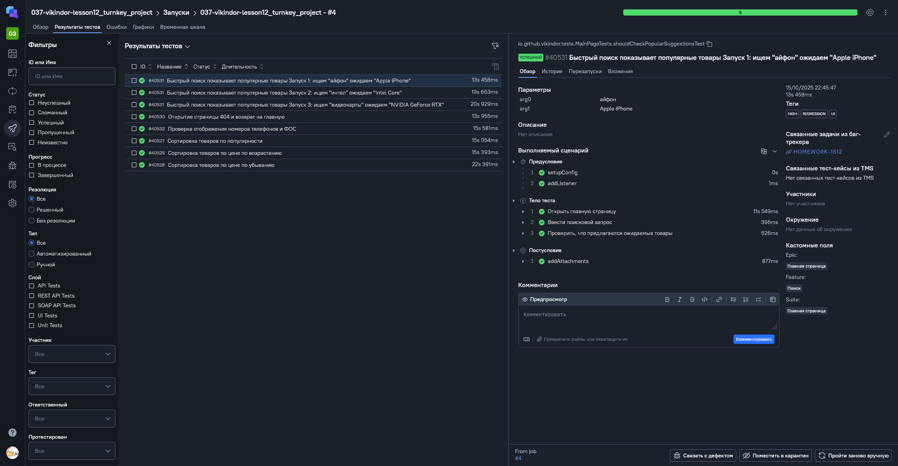
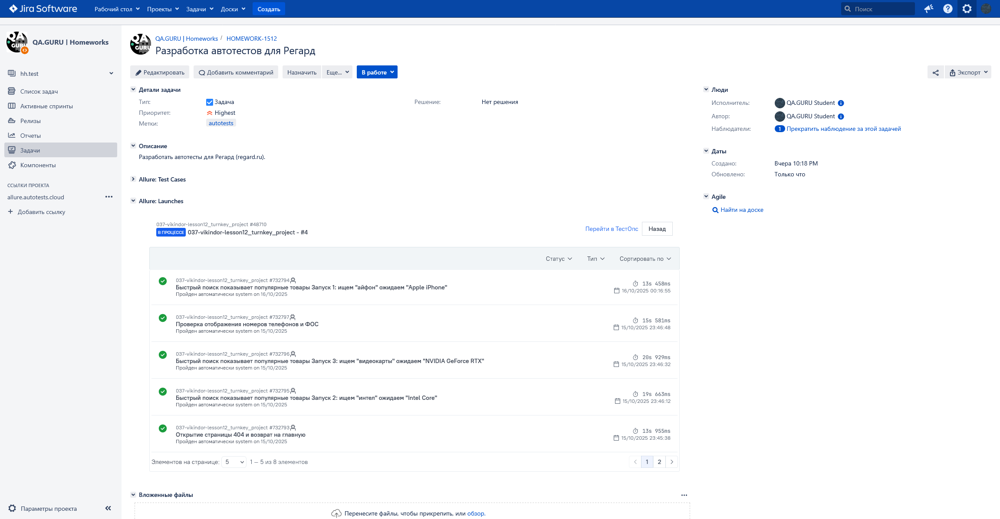
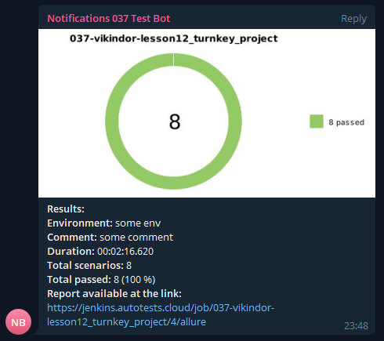
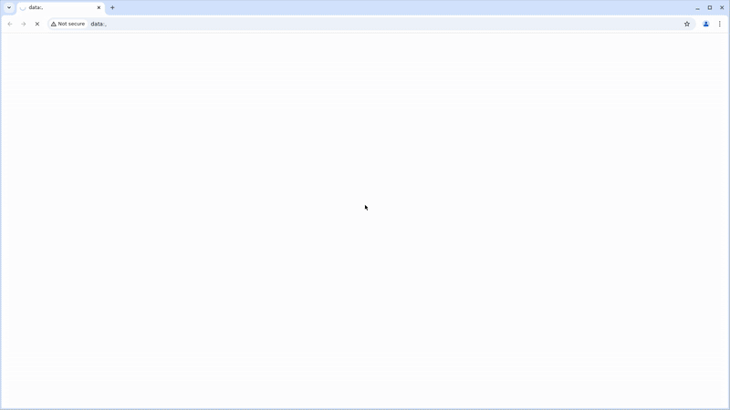

<h1 align="center">
Проект по автоматизации тестовых сценариев<br>для магазина <a href="https://www.regard.ru/" target="_blank" rel="noopener noreferrer">Регард</a>
<br><br>
<a href="https://www.regard.ru/" target="_blank" rel="noopener noreferrer"></a>
</h1>

## 📌 Содержание:

- [Использованный стек технологий](#использованный-стек-технологий)
- [Запуск тестов из терминала](#запуск-автотестов)
- [Сборка в Jenkins](#сборка-в-jenkins)
- [Пример Allure-отчёта](#пример-allure-отчёта)
- [Уведомления в Telegram с использованием бота](#уведомления-в-telegram-с-использованием-бота)
- [Видео примера запуска тестов в Selenoid](#-видео-примера-запуска-теста-в-selenoid)

## 💻 Использованный стек технологий

<p align="center">
  <a href="https://www.jetbrains.com/idea/" target="_blank" rel="noopener noreferrer"></a>
  <a href="https://gradle.org/" target="_blank" rel="noopener noreferrer"></a>
  <a href="https://www.java.com/" target="_blank" rel="noopener noreferrer"></a>
  <a href="https://selenide.org/" target="_blank" rel="noopener noreferrer"></a>
  <a href="https://junit.org/" target="_blank" rel="noopener noreferrer"></a>
  <a href="https://github.com/" target="_blank" rel="noopener noreferrer"></a>
  <a href="https://aerokube.com/selenoid/latest/" target="_blank" rel="noopener noreferrer"></a>
  <a href="https://qameta.io/" target="_blank" rel="noopener noreferrer"></a>
  <a href="https://www.jenkins.io/" target="_blank" rel="noopener noreferrer"></a>
  <a href="https://telegram.org/" target="_blank" rel="noopener noreferrer"></a>
  <a href="https://qameta.io/" target="_blank" rel="noopener noreferrer"></a>
  <a href="https://www.atlassian.com/software/jira" target="_blank" rel="noopener noreferrer"></a>
</p>

- В данном проекте автотесты написаны на языке <code>Java</code> с использованием фреймворка для тестирования <code>Selenide</code>.
- В качестве сборщика был использован - <code>Gradle</code>.  
- Использованы фреймворки <code>JUnit 5</code> и <code>Selenide</code>.
- При прогоне тестов браузер запускается в <code>Selenoid</code>.
- Для удаленного запуска реализована джоба в <code>Jenkins</code> с формированием <code>Allure Report</code> и отправкой результатов в <code>Telegram</code> при помощи бота. 
- Осуществлена интеграция с <code>Allure TestOps</code> и <code>Jira</code>

Содержание Allure-отчёта:
* Шаги теста;
* Скриншот страницы на последнем шаге;
* Page Source;
* Логи браузерной консоли;
* Видео выполнения автотеста.

## ▶️ Запуск автотестов

### Запуск тестов из терминала

При выполнении команды данные тесты запустятся локально.

```
gradle clean test
```

### Запуск тестов на удаленном браузере

При выполнении команд данные тесты запустятся удаленно в <code>Selenoid</code>.

```
gradle clean test
-DremoteUrl=${SELENOID_URL}
-Dbrowser=${BROWSER}
-DbrowserVersion=${BROWSER_VERSION}
-DbrowserSize=${BROWSER_SIZE}
allureReport
```

### Параметры сборки

* <code>SELENOID_URL</code> - ссылка на Selenoid. По умолчанию: <code>selenoid.autotests.cloud</code>.
* <code>BROWSER</code> – браузер, в котором будут выполняться тесты. По-умолчанию: <code>chrome</code>.
* <code>BROWSER_VERSION</code> – версия браузера, в которой будут выполняться тесты. По-умолчанию - <code>128.0</code>.
* <code>BROWSER_SIZE</code> – размер окна браузера, в котором будут выполняться тесты. По умолчанию: 1920x1080.

##  Сборка в Jenkins
<p align="center">

</p>

##  Пример Allure отчёта

### Overview

<p align="center">

</p>

### Результат выполнения теста

<p align="center">

</p>

##  Интеграция с Allure TestOps

Выполнена интеграция сборки <code>Jenkins</code> с <code>Allure TestOps</code>.
Результат выполнения автотестов отображается в <code>Allure TestOps</code>.
На Dashboard в <code>Allure TestOps</code> отображена статистика пройденных тестов.

<p align="center">

</p>

##  Интеграция с Jira

Реализована интеграция <code>Allure TestOps</code> с <code>Jira</code>.

<p align="center">

</p>

##  Уведомления в Telegram с использованием бота

После завершения сборки бот, созданный в <code>Telegram</code>, автоматически обрабатывает и отправляет сообщение с результатом.

<p align="center">

</p>

##  Видео примера запуска тестов в Selenoid

К каждому тесту в отчёте прилагается видео прогона.

<p align="center">

</p>
